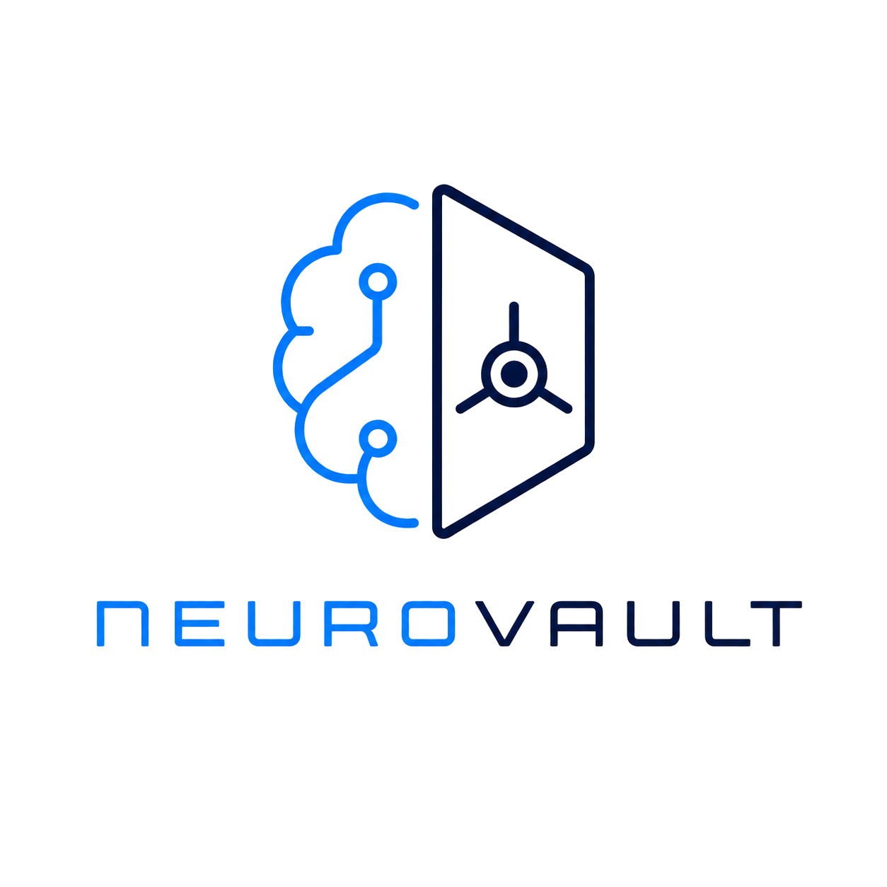
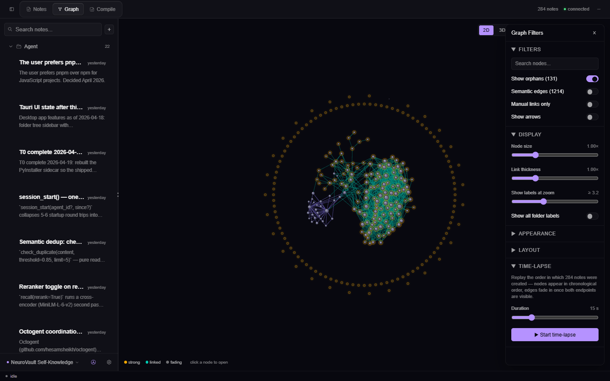
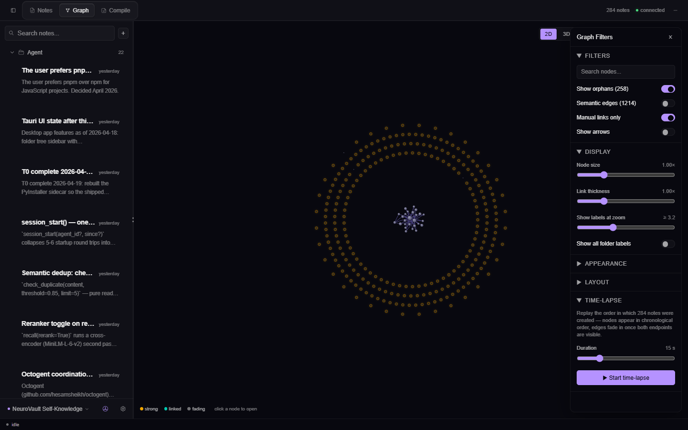
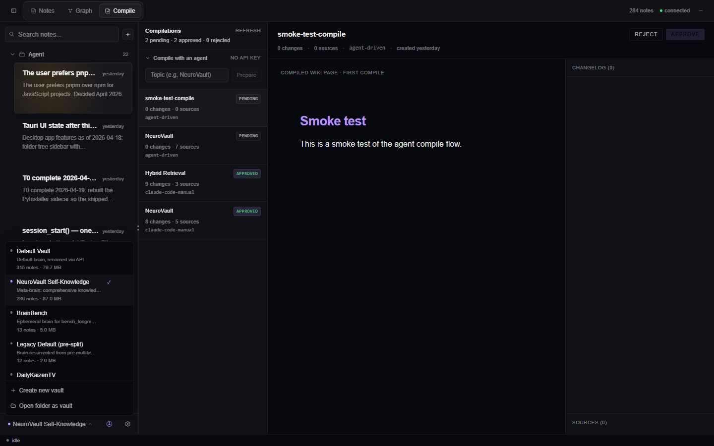
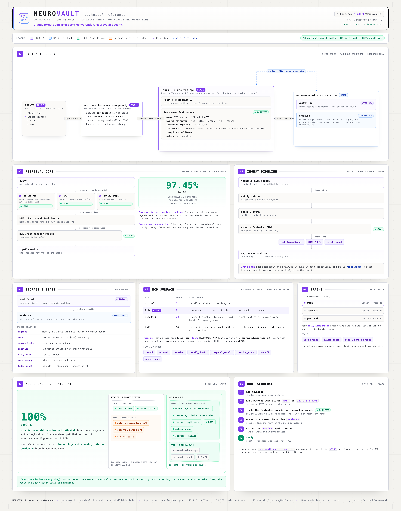

<div align="center">

<picture>
  <source media="(prefers-color-scheme: dark)" srcset="assets/brand/neurovault-logo-dark.png">
  
</picture>

### The private commercial desktop application

Claude forgets you after every conversation. **NeuroVault doesn't.**

[](LICENSE)


**[Open-source Core](https://github.com/sirdath/neurovault-core) · [Website](https://neurovault.dathproject.com) · [App Store preparation](docs/APP-STORE-READINESS.md)**

</div>

<br>

<div align="center">
  
</div>

<br>

NeuroVault is a **local-first memory layer for AI agents**. It sits between your Markdown notes and supported AI clients and gives them durable recall across sessions. Note/engram content stays in plain `.md` files and can be re-indexed; SQLite also holds structured state such as core-memory blocks, drafts, and version history, so a complete brain backup includes both the vault and database. Selected context reaches only the AI providers you deliberately connect, under the data flow described in [PRIVACY.md](PRIVACY.md).

The open engine follows the [Core Covenant](CORE-COVENANT.md) and now lives in
[NeuroVault Core](https://github.com/sirdath/neurovault-core). This repository
contains the paid consumer shell and is private.

> Not RAG-in-a-trenchcoat. A structured, updatable, inspectable knowledge base an AI can read, write, and challenge. [Why this is not RAG ↓](#why-this-is-not-rag)

---

## Distribution status

NeuroVault Desktop is being prepared as a paid-upfront Mac App Store app. It is
not currently offered for public download from this private repository. The
Store build must pass sandboxing, offline first-use, security-scoped vault
access, receipt-independent local operation, and TestFlight verification before
it is submitted.

The last public source release, v0.6.0, remains MIT-licensed for anyone who
received it under those terms. Its license is preserved at
`LICENSES/NeuroVault-v0.6.0-MIT.txt`. New commercial Desktop work begins after
the `desktop-mit-final-v0.6.0` provenance tag.

There are currently two build flavors, and their capabilities must not be
confused:

| Flavor | Current purpose | Current capability |
| --- | --- | --- |
| Direct distribution | Internal development and the historical Direct app | Full automatic-context hooks, MCP/HTTP integration, Review/Trust, Today, updater, minitab, and external-vault workflows described below. |
| Mac App Store | Sandboxed release candidate | Standalone local Libraries, Memories, Search, Graph, editing, import/export, themes, and a bundled on-device embedding model. It includes no sidecar, hook installer, updater, reranker, or external-AI connection. Some shared transport/server modules and dependencies remain statically compiled today, but the Store IPC surface is narrowed and it does not start or expose the loopback HTTP server. |

The Store flavor is an architecture scaffold, **not the paid product promised
by the rest of this README yet**. It is not credible at the planned price until
it regains the automatic, source-backed memory loop through an App
Store-compliant connection design. See
[App Store readiness](docs/APP-STORE-READINESS.md) and
[commercial strategy](docs/COMMERCIAL-STRATEGY.md). Do not copy the direct-only
claims below into App Store metadata.

## Full direct-distribution capability set

The following is the implemented direct/internal flavor, not the current
sandboxed Store feature set.

- **Graphify your codebase** — point NeuroVault at a repo and it becomes part of your active vault: files, symbols, and call edges parsed **on-device** (tree-sitter — Rust, Python, TS/TSX, Go, Java, C#, Ruby) and rendered as a gold layer in the graph. Your connected AI can ask `where_defined`, `who_calls`, `blast_radius` (what breaks if I change this?) — and `fuse` links code to the notes and decisions about it. NeuroVault does not upload source while building the graph.
- **Knowledge graph view** — your notes as a living, force-directed map. Node **fill = category** (folder), a **ring = health** (teal active · amber fresh · grey dormant), and **size = importance** (PageRank) in Analytics mode. Spread/zoom controls, animations toggle, Venn-style category grouping, time-lapse playback, and a click-to-frame cluster legend.
- **Hybrid retrieval, always on** — semantic + BM25 keywords + knowledge graph, fused via RRF, then a cross-encoder reranker (on by default). In-process Rust.
- **Markdown editor** with live preview, auto-save, drag-to-reorder tabs, and `[[wikilinks]]`.
- **Import inbox** — drag a file onto the window to copy it into a private staging area without changing the original. Connected workflows can turn staged material into indexed notes. [How it works →](https://neurovault.dathproject.com/docs#drop-folder)
- **Silent fact capture** — casually-dropped facts ("I prefer Rust over Go") get promoted to first-class memories with provenance back to where you said them. (Optional Claude Code hook, run by the same native `neurovault-server` binary — no Python.)
- **Multiple vaults** — separate files and databases per project; switch from the vault picker or command palette.
- **Per-folder boundaries** — drop a `.neurovault` file in a project directory to scope that folder's connected memory to its own vault (opt-in).
- **Agent auto-start** — your MCP agent starts the memory backend for you on first use; no need to open the app first.
- **Floating minitab + window modes** — shrink the whole app to a tiny always-on-top widget (status · start/pause · open), or **Minimize / Hide / Shrink to widget** from the top bar; bring it back with `Ctrl/Cmd+Shift+Space`.
- **Open a folder as a vault** — point NeuroVault at an existing Obsidian vault; the folder stays in place.
- **Notes-tree + graph share colours**, themes, resizable panels, and **signed one-click auto-update**.
- **Local-first, with an exact network contract.** No NeuroVault account or telemetry. The server is loopback-only on `127.0.0.1:8765`; selected context leaves the Mac only through AI providers you deliberately connect, and model/update downloads are disclosed in [PRIVACY.md](PRIVACY.md).

## Connect your agent (MCP)

> **Direct-distribution flavor only.** The current Mac App Store flavor does
> not bundle this server or write another application's configuration.

**Installed app (one click):** open **Settings → Connect Claude Code** and hit **Register automatically** — it merges NeuroVault into `~/.claude.json` (your existing login + config are preserved), then restart your Claude Code session. For **Claude Desktop**, the same panel generates the exact JSON snippet to paste. Full walkthrough in the [Quickstart](https://neurovault.dathproject.com/docs#quickstart).

> **Tiers** — by default the agent loads the **`lite`** tier (8 tools). Switch to `standard` (21) or `full` (55, includes the graphify code tools) in **Settings → MCP** or via `~/.neurovault/mcp_tier.txt`. Fewer tools = less context the agent pays for up front.

**Manually**, point your MCP client at the bundled native MCP server — `neurovault-server --mcp-only`, a Rust stdio↔HTTP bridge built on the official [rmcp](https://github.com/modelcontextprotocol/rust-sdk) SDK (no Python):

```json
{
  "mcpServers": {
    "neurovault": {
      "command": "/Applications/NeuroVault.app/Contents/MacOS/neurovault-server",
      "args": ["--mcp-only"]
    }
  }
}
```

(macOS path shown; on Windows/Linux it's the `neurovault-server` binary that ships next to the app. The Settings dialog fills in the exact path for you.)

It forwards to the Rust HTTP server in the running app on `127.0.0.1:8765`. You don't need to open the app first — the MCP server **auto-starts the backend** if it isn't already running (disable with `NEUROVAULT_AUTOSTART=0`). Now say *"remember that I prefer Tauri over Electron"*; weeks later, ask *"what desktop framework do I like?"* and it recalls instantly.

## Automatic memory (zero effort)

> **Direct-distribution flavor only.** A Store-compliant automatic-context
> transport is still a launch blocker.

MCP memory has a known weakness: the agent only remembers if it *decides* to call `recall` — and models routinely don't. NeuroVault fixes this with **automatic recall** for Claude Code: relevant memories are injected into every prompt automatically, no tool call needed.

Turn it on in **Settings → Automatic Memory (Claude Code)**, or from the terminal:

```bash
neurovault-server hook install     # wires ~/.claude/settings.json
neurovault-server hook status
neurovault-server hook uninstall
```

How it works: Claude Code [hooks](https://code.claude.com/docs/en/hooks) run NeuroVault on every prompt (`UserPromptSubmit`) and at session open (`SessionStart`). Each prompt goes through **Ambient Recall**: the full hybrid retriever (semantic + BM25 + graph, fused, then a cross-encoder reranker) followed by a precision gate that decides whether anything is trustworthy enough to inject. Injected memories arrive as compact, sanitized background context with IDs, source paths, and a one-line "why". At session start you get a one-shot vault brief: core memory, top memories, open tasks.

**Ambient Recall prefers silence over weak context.** Vector search always has *some* nearest neighbor, so an ungated injector would decorate every prompt with plausible-but-useless notes. The gate requires an absolute cross-encoder score floor (raised further for vague prompts, relaxed slightly for exact file/symbol/error matches) and a margin over the runner-up — when confidence is low it injects **nothing**, and that's a success, not a failure. Every decision (inject or silent, with all scores) is logged to `~/.neurovault/logs/ambient_recall.jsonl`.

Design guarantees:

- **Fail-open.** If NeuroVault isn't running, the hooks print nothing and exit 0 — your Claude Code session is never blocked or slowed (hard 3.5 s budget). The installed hook command is wrapped so even a broken or stale binary can't block a prompt.
- **Signal only.** Trivial prompts are skipped before any network call, gated memories need real relevance scores, and a memory is never injected twice in the same session.
- **Reversible.** Install is idempotent and edits only NeuroVault's own entries in `settings.json` (a backup is written first); uninstall removes exactly those.
- **Tunable.** Thresholds, budgets, strict mode, and per-vault overrides live in `~/.neurovault/ambient.json`; debug any prompt with `neurovault-server ambient test "your prompt"` — it prints the candidate table, every score, and the gate's reasoning. Details: [docs/ambient-recall.md](docs/ambient-recall.md).

## Screenshots

| | |
|---|---|
|  |  |
| **Filters panel.** Every graph knob in one place — spread, edge-type filters, node size, layout, animations, grouping, time-lapse. Live, no re-render. | **Cmd+K palette.** One prompt, three sections — *Commands* (fuzzy), *Notes* (title search), *Memory* (semantic recall after 3+ chars). |
|  |  |
| **Semantic edges.** Toggle the inferred-similarity layer; `manual`, `entity`, and `semantic` links each get their own colour. | **Settings.** Theme, density, server controls, MCP connection diagnostics, and the update checker. |

---

## How it works

```
You write a note in the editor
  -> Auto-saved as markdown in your vault
  -> File watcher triggers the ingest pipeline
  -> Text chunked, embedded locally, entities extracted, knowledge graph updated

You drop a fact in conversation ("I prefer Tauri 2.0 over Electron")
  -> A UserPromptSubmit hook runs it through a regex extractor
  -> 8 patterns catch preferences, decisions, deadlines, identities, stacks
  -> Each fact becomes a first-class kind='insight' engram
  -> With a wiki-link back to the original observation for provenance

You ask the agent a question
  -> Agent calls recall() via MCP
  -> Hybrid search: semantic + BM25 + knowledge graph, fused via RRF
  -> Recent / contested decisions get a score bonus; dormant ones fade
  -> Top memories returned at a flat ~275 tokens regardless of vault size

After meaningful exchanges
  -> Write-back extracts durable facts and saves them as new notes
  -> Strength decay reinforces what you keep using; unused notes fade
```

## Why this is not RAG

RAG is an answer-pipeline: chunk, embed, retrieve K chunks, stuff the context, generate, repeat. The corpus is dead data, retrieval has no memory of past retrievals, contradictions are invisible, provenance is a prayer.

NeuroVault is a **knowledge layer**. It differs in five ways that map to what a living internal wiki needs:

| What a wiki needs | RAG's answer | NeuroVault's answer |
|---|---|---|
| **Accumulate over time** | re-chunk, re-embed | Ebbinghaus strength decay + access reinforcement. Used facts stay strong; unused fade. |
| **Structure** | flat chunks | Karpathy's 3-layer raw/wiki/schema pattern; engrams typed `note`/`source`/`quote`/`insight`/`observation`. |
| **Link** | none | Three automatic link types (semantic, shared-entity, explicit `[[wikilinks]]`) + a force-directed graph. |
| **Provenance** | cite the chunk | Silent fact capture stores `**Source:** [[observation-...]]` links back to the exact prompt where a fact was said. |
| **Challenge / update** | none | Temporal fact tracking — a contradicting fact supersedes the old one, which then takes a recency penalty in retrieval. |

## Features

**Multiple vaults** — separate memory spaces, each with its own Markdown boundary, database, and graph. Switch instantly via the dropdown or a connected agent.

**Hybrid retrieval** — three signals merged via Reciprocal Rank Fusion: semantic vector similarity (50%), BM25 keywords (30%), knowledge-graph traversal (20%). A cross-encoder reranker runs by default for extra precision (toggle off in Settings).

**Memory strength** — Ebbinghaus forgetting curve with access reinforcement. Frequently retrieved memories stay strong; unused ones fade.

**Graph view** — force-directed visualization. Fill encodes category, a ring encodes health/strength, size encodes importance (Analytics mode). Click a node to open, drag to pin, click a cluster in the legend to frame it.

**Drop-folder ingest** — a per-vault **`raw/`** folder (with a `README.md` guide inside); paste documents there and the connected agent converts them into clean notes (no bundled converters — the agent is the converter). Originals are kept in `raw/_done/`.

**Silent fact capture** — a UserPromptSubmit hook pipes prompts through a regex extractor recognising 8 patterns (preferences, decisions, stacks, deadlines, identity, anti-preferences, deploy targets, explicit "remember that…"). Microseconds, no LLM call, bounded to 3 extractions/message, `<private>` blocks stripped.

**Session wake-up** — `session_start` returns layered context: L0 (~100 tokens, identity), L1 (~300 tokens, top active memories), L2 (on demand via `recall()`).

**Vault diagnostic** — a one-click health scorecard for your vault. Distils the graph into five graded categories + a headline grade and a worst-first list of fixes. "Copy report" emits a plain-text scorecard you can paste to your agent, so it acts on the issues — the maintenance loop the agent is meant to own.

```
NeuroVault vault diagnostic — work
Overall: B  (84/100, 412 notes)

Connectivity  ██████████████████████░░  88%
Interlinking  ███████████████░░░░░░░░░  63%
Cohesion      ███████████████████████░  94%
Freshness     ██████████████████░░░░░░  74%
Organization  ████████████░░░░░░░░░░░░  51%

Top fixes:
  - 49 orphan notes with no links — connect or merge them
  - 201 unfiled notes in the root — sort into folders
```

---

## Quick start (developers)

This section is for maintainers with access to the private Desktop repository.
Public engine development belongs in
[NeuroVault Core](https://github.com/sirdath/neurovault-core).

**Prerequisites:** [Node.js](https://nodejs.org/) 20+, [Rust](https://rustup.rs/). That's it — the MCP server is a native Rust binary (`neurovault-server`), built alongside the app. No Python is needed to build or run anything. (The only Python in the repo is offline tooling the app never invokes: the `eval/` retrieval harness, the `docs/benchmarks/` report mergers, and two icon generators in `scripts/`.)

```bash
git clone https://github.com/sirdath/NeuroVault.git
cd NeuroVault
npm install

# One terminal — the Tauri shell hosts the React frontend AND the
# in-process Rust HTTP server on 127.0.0.1:8765. Nothing else to start.
npx tauri dev

# Release build (installer at src-tauri/target/release/bundle/):
npx tauri build
```

**Direct-flavor model downloads** (once, then cached):

- **BGE-small-en-v1.5** (~130 MB) on first ingest/recall, and the separate
  **BGE reranker** (~1 GB) on first reranked recall. The Store flavor bundles
  BGE-small for offline first use and excludes the reranker.

The `sqlite-vec` (`vec0`) native extension is bundled with Direct builds. The
currently verified Direct macOS target is **Apple Silicon on macOS 14+**. The
repo carries only the arm64 loadable extension, so an Intel build is not a
working distribution until an x86_64 or universal `vec0` is supplied.

## MCP tools

Exposed to any MCP-speaking agent via the native Rust MCP server — **55 tools**, gated by a **tier** system so agents only pay for the slice they use: `minimal` (3) · `lite` (8, the default) · `standard` (21) · `full` (55, includes the graphify code tools). Set it with `NEUROVAULT_MCP_TIER`, `~/.neurovault/mcp_tier.txt`, or Settings → MCP. Every tool takes an optional `brain` parameter to target a specific brain. Highlights:

| Tool | What it does |
|------|-------------|
| `recall(q, mode, limit, rerank?)` | Hybrid search — semantic + BM25 + graph via RRF, rerank on by default. PageRank prior in Analytics mode. |
| `recall_chunks(q, limit)` | Same retrieval, returns matching paragraphs instead of whole notes. Cheaper. |
| `related(engram_id, hops, link_types?)` | Direct graph neighbours of an engram. ~50× cheaper than a fresh recall. |
| `remember(content, title?, dedupe?)` | Save a memory (chunk + embed + entities + graph link). |
| `list_inbox` / `read_inbox_file` / `mark_inbox_done` | Drop-folder workflow — read raw dropped files and turn them into notes. |
| `session_start(agent?, since?)` | Wake-up: brain stats + L0 identity + top memories + open todos in one call. Pass `agent=X` to scope it to X's own recent engrams + X's inbox instead of the brain-wide view. |
| `handoff(to_agent, type, …)` / `agent_inbox(agent)` | Multi-agent coordination — route a directed, inert message to another agent through the shared brain, and read the open handoffs addressed to an agent. Pull-based; nothing auto-runs. |
| `core_memory_set` / `_append` / `_replace` / `_read` | Persona-style always-included blocks (Letta pattern). |
| `list_brains` / `switch_brain` / `create_brain` | Multi-brain navigation. |
| `check_duplicate(content, threshold)` | Pure cosine pre-check before `remember()`. |
| `list_unnamed_clusters` / `set_cluster_names` | Agent-driven cluster naming for the graph's Analytics mode. |
| `find_contradictions` / `supersede_note` / `resolve_contradiction` | Surface conflicting memories and reconcile them — the newer fact wins, reversibly. |
| `temporal_recall` / `engram_history` / `diagnose_brain` / `find_clutter` | Time-travel queries, per-note edit history, and brain-health/maintenance tools. |
| `rebuild_wikilinks` | Re-resolve every `[[wikilink]]` across the brain — fixes forward references and links to titles with a `(parenthetical)` suffix. |

---

## Architecture

**[Full technical reference map](docs/reference.html)** — the historical Direct
topology, hybrid retrieval core, ingest, storage, and 55-tool MCP surface.
Inference runs on-device; disclosed model acquisition, updates, and connected
AI-provider flows are covered in [PRIVACY.md](PRIVACY.md).

[](docs/reference.html)

```
+-------------------------------------------------+
|  Tauri 2 desktop app (React 19 + TypeScript)    |
|  Editor / Graph / Sidebar / Command palette     |
+-----------------------+-------------------------+
                        | Tauri commands  +  HTTP :8765
+-----------------------v-------------------------+
|  In-process Rust backend                        |
|  - axum HTTP server (the MCP server talks here) |
|  - hybrid retriever (semantic + BM25 + graph)   |
|  - fastembed-rs (BGE-small ONNX, local)         |
|  - notify file watcher                          |
+-----------------------+-------------------------+
                        | SQL + vec0
+-----------------------v-------------------------+
|  SQLite + sqlite-vec  (~/.neurovault/...)       |
|  brain.db, vault/*.md, raw/, assets/, cache/    |
+-------------------------------------------------+

External:
  + neurovault-server --mcp-only — native Rust stdio<->HTTP MCP server
    (rmcp; bundled binary). Your agent spawns it per session; no Python.
    The same binary also serves the Claude Code lifecycle hooks
    (`neurovault-server hook …`). No Python anywhere in the product.
```

Markdown in `vault/` is canonical for note/engram content, and `raw/` retains
imported inputs. Retrieval indexes can be rebuilt from those files, but
`brain.db` also contains structured state without Markdown mirrors (including
core-memory blocks, drafts, and version history). Export or back up the whole
brain for complete recovery. Full layout + privacy details: [PRIVACY.md](PRIVACY.md).

## Tech stack

| Layer | Technology |
|-------|-----------|
| Desktop | Tauri 2 (no Electron — ~24 MB download / ~50 MB installed) |
| Frontend | React 19, TypeScript (strict), Tailwind v4, Zustand |
| Editor | CodeMirror 6 |
| Graph | `react-force-graph-2d/3d` (lazy-loaded), d3-force, canvas painting |
| **Backend (in-process)** | **Rust + axum, fastembed-rs ONNX embeddings, rusqlite + sqlite-vec, notify, parking_lot, tokio** |
| Vector search | sqlite-vec (KNN in pure SQL) |
| Embeddings | BAAI/bge-small-en-v1.5 (384 dims, local, free) |
| Keywords | BM25 (Rust port of Okapi) |
| Graph metrics | Vanilla TS PageRank + Louvain |
| MCP server | `neurovault-server --mcp-only` — native Rust ([rmcp](https://github.com/modelcontextprotocol/rust-sdk)), forwards stdio↔HTTP to `:8765` (replaces the old Python proxy) |

## Performance

| Operation | Time |
|-----------|------|
| Embed a note | ~20 ms |
| Recall (no reranker) | ~73 ms median |
| Recall (with reranker) | ~133 ms median |
| Full vault ingest (25 notes) | ~4 s cold start |

**Retrieval quality** — measured on the **470 answerable questions** in the
cleaned LongMemEval-S set (the 30 abstention questions are excluded), using
NeuroVault's real `recall()` implementation with the reranker on while
ablating production recency and synthetic-title boosts for reproducibility.
This is a retrieval benchmark configuration, not the full shipped runtime
configuration or an end-to-end answer-quality score:

| hit@5 | hit@10 | recall@5 | MRR | hit@1 |
|-------|--------|----------|-----|-------|
| **97.45%** | **98.5%** | **0.938** | **0.902** | **0.847** |

> The right memory lands in the **top 5 results 97% of the time**, in the top 10 **99%** — running entirely on your machine, no cloud, no API keys. This is retrieval recall (was the right memory retrieved), not end-to-end QA accuracy. Reproducible: full harness + a per-question receipt in [`docs/benchmarks/`](docs/benchmarks/), plus the isolated reranker A/B in [`docs/benchmarks/ANALYSIS-2026-07-02-miss5-forensics.md`](docs/benchmarks/ANALYSIS-2026-07-02-miss5-forensics.md).

**Cost** — on-device embeddings and retrieval have no per-call API fee. The
retrieval engine is open source in NeuroVault Core; Desktop is the paid
consumer application. Optional network flows are documented in
[PRIVACY.md](PRIVACY.md).

## Keyboard shortcuts

| Shortcut | Action |
|----------|--------|
| `⌘N` | New note |
| `⌘S` | Save |
| `⌘K` | Command palette |
| `⌘⇧Space` | Quick capture |
| `⌘/` | Search memory |
| `⌘1` / `⌘2` / `⌘3` | Today / Memories / Graph |
| `⌘P` | Cycle Memories and Graph |
| `?` | All shortcuts |

On Windows and Linux, use `Ctrl` in place of `⌘`.

---

## Documentation

Full docs — quickstart, the graph view, drop-folder ingest, architecture, and the HTTP API — live at **[neurovault.dathproject.com/docs](https://neurovault.dathproject.com/docs)**.

In the repo:
- **[Troubleshooting & data](docs/TROUBLESHOOTING.md)** — install warnings, MCP setup, backup/move/export, recovering a corrupt index.
- **[How NeuroVault works](docs/HOW-NEUROVAULT-WORKS.md)** — the architecture and retrieval pipeline in depth.
- **[HTTP API](docs/api.md)** · **[Contributing](CONTRIBUTING.md)** · **[Privacy](PRIVACY.md)** · **[Security](SECURITY.md)**.

## Development

This repository is private. Public engine contributions belong in
[NeuroVault Core](https://github.com/sirdath/neurovault-core). Internal Desktop
changes must preserve the Core compatibility boundary and pass the full gate.
Security reports follow [SECURITY.md](SECURITY.md).

## License

NeuroVault Desktop is commercial software. See [LICENSE](LICENSE) for the
cutover boundary and [the preserved v0.6.0 MIT license](LICENSES/NeuroVault-v0.6.0-MIT.txt)
for public-era code. Third-party and NeuroVault Core components retain their
own licenses.

<div align="center"><sub>Automatic enough to disappear. Transparent enough to trust.</sub></div>
