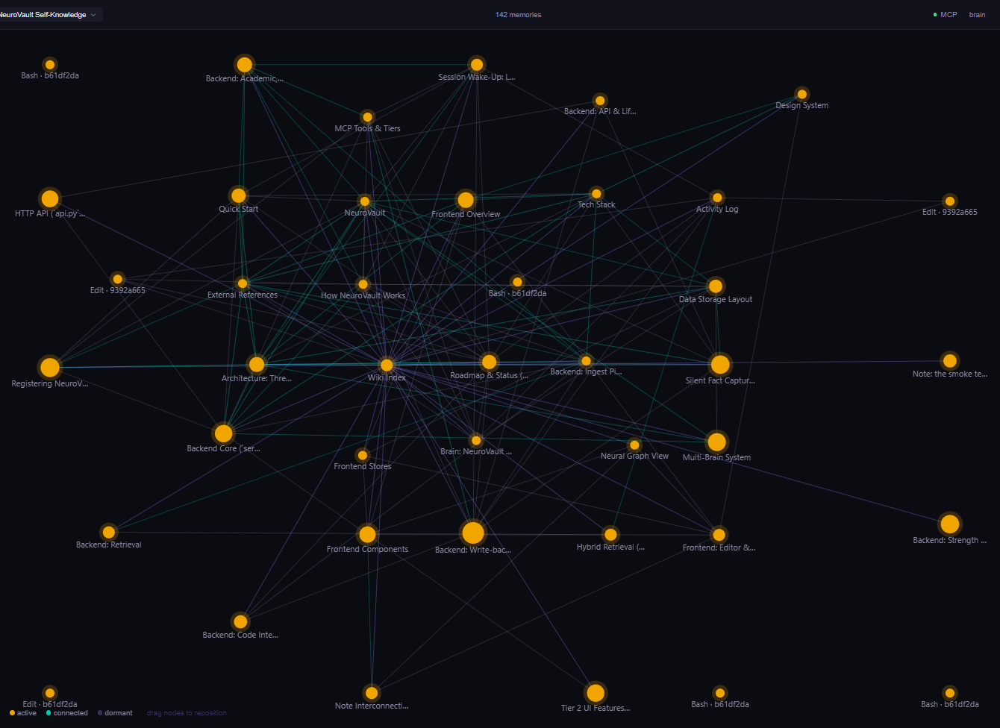
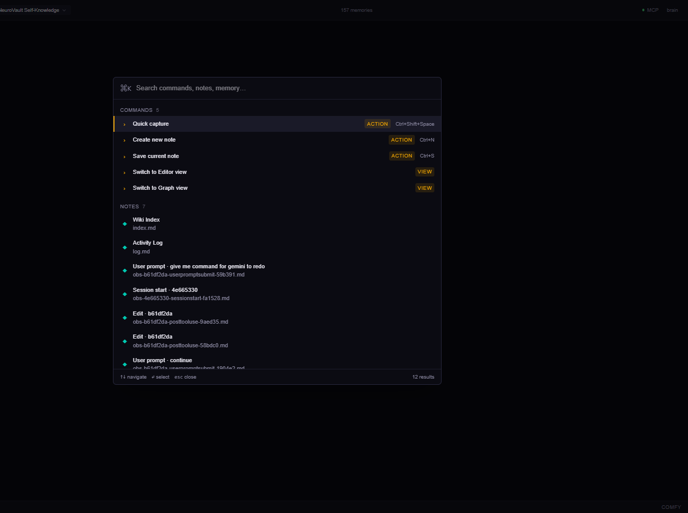

```
███╗   ██╗███████╗██╗   ██╗██████╗  ██████╗ ██╗   ██╗ █████╗ ██╗   ██╗██╗  ████████╗
████╗  ██║██╔════╝██║   ██║██╔══██╗██╔═══██╗██║   ██║██╔══██╗██║   ██║██║  ╚══██╔══╝
██╔██╗ ██║█████╗  ██║   ██║██████╔╝██║   ██║██║   ██║███████║██║   ██║██║     ██║
██║╚██╗██║██╔══╝  ██║   ██║██╔══██╗██║   ██║╚██╗ ██╔╝██╔══██║██║   ██║██║     ██║
██║ ╚████║███████╗╚██████╔╝██║  ██║╚██████╔╝ ╚████╔╝ ██║  ██║╚██████╔╝███████╗██║
╚═╝  ╚═══╝╚══════╝ ╚═════╝ ╚═╝  ╚═╝ ╚═════╝   ╚═══╝  ╚═╝  ╚═╝ ╚═════╝ ╚══════╝╚═╝

                     local-first AI memory for Claude
```

# NeuroVault

A local-first AI memory system. Claude forgets you after every conversation. NeuroVault does not.

---

## Download and install

**Windows:** [NeuroVault_0.1.0_x64-setup.exe](https://github.com/daththeanalyst/NeuroVault/releases/latest) (roughly 30 MB installer).

1. Download the installer.
2. Double-click to install.
3. Open NeuroVault from the Start menu or desktop shortcut.
4. Start taking notes. They are saved as plain markdown files in `~/.neurovault/`.

> **Windows SmartScreen.** The app is not code-signed yet. You will see a "Windows protected your PC" warning on first launch. Click **More info**, then **Run anyway**.

## Data safety

NeuroVault is local-first by design. The short version:

- **No telemetry.** No analytics, no crash reporter, no phone-home on startup.
- **No account.** There is no NeuroVault login.
- **No cloud sync.** The vault is a folder of markdown files on your machine. Back it up, sync it, or delete it however you want.
- **Loopback-only server** (`127.0.0.1:8765`). It refuses connections from other machines.
- **Network is used only when you explicitly ask for it**, such as downloading embedding models on first run, checking for app updates, or calling the Claude API for compile pages (which requires your own API key).

Full details, including what lives in `~/.neurovault/`, how to delete data, and what the MCP server logs, are in [PRIVACY.md](PRIVACY.md).

## What you get

- **Markdown editor** with live preview, auto-save, drag-to-reorder tabs, and `[[wikilinks]]`.
- **Seven themes.** Midnight, Claude, OpenAI, GitHub Dark, Rosé Pine, Nord, Obsidian.
- **Knowledge graph view** showing how your notes connect — with an opt-in **Analytics mode** that sizes nodes by importance and groups them into communities. See [docs/graph-analytics.md](docs/graph-analytics.md).
- **Hybrid search.** Semantic plus keyword plus knowledge graph, always on, in-process Rust. Analytics mode also boosts recall by note importance (PageRank).
- **Agent-driven brain maintenance.** Cluster names, future deduplication and folder suggestions all run via your existing Claude / Cursor session. No API keys, no second bill.
- **Compilation loop.** AI maintains canonical wiki pages from your raw notes. Drives Claude Code directly via the copy-pack flow, no API key needed.
- **Multi-vault support.** Switch, rename, delete via the dropdown (bottom-left).
- **Open a folder as vault.** Point NeuroVault at an existing Obsidian vault. The folder stays in place. Deleting the brain never touches the folder.
- **Folders in the sidebar.** Rename a note to `projects/foo.md` and it moves into a folder tree. Right-click any note for the rename / reveal / copy-link / delete menu.
- **Fast-switch.** Ctrl+K, type a brain name, Enter. Per-brain entries in the palette.
- **100 percent local.** Notes never leave your machine.
- **Resizable panels.** Drag to customize layout.

## For AI agents (MCP setup)

**If you installed NeuroVault from the release:**
Open the app, go to **Settings**, and click **Connect Claude Desktop**. It generates the exact JSON for your install path with a one-click copy button, plus a **Show in folder** button for `claude_desktop_config.json`. Restart Claude Desktop after saving.

**If you are running from source**, paste this into Claude Desktop's config (`%APPDATA%\Claude\claude_desktop_config.json` on Windows, `~/Library/Application Support/Claude/claude_desktop_config.json` on macOS):

```json
{
  "mcpServers": {
    "neurovault": {
      "command": "uv",
      "args": ["--directory", "C:\\path\\to\\NeuroVault\\server", "run", "python", "-m", "neurovault_server"]
    }
  }
}
```

Claude now has persistent memory across conversations. Say things like "remember that I prefer Rust over Go" and NeuroVault saves it. Weeks later, ask "what do I prefer for backend work?" and Claude recalls it instantly.

---

## For developers

A local-first knowledge layer for AI agents. Not RAG. A living internal wiki.

Most "agent memory" products today are retrieval pipelines in a trench coat: chunk, embed, retrieve, hallucinate, repeat. NeuroVault is what you get when you stop treating memory as search over a pile of chunks and start treating it as a structured, updatable, inspectable, human-editable knowledge base that an AI can read, write, and challenge.

Concretely, NeuroVault is:

- A **local markdown vault** you own forever (`~/.neurovault/brains/{name}/vault/*.md`).
- A **Tauri desktop app** for humans to explore what the agent knows. Neural graph view, wikilinks, hover previews, backlinks with paragraph context, Cmd+K command palette.
- An **MCP server** agents connect to directly (Claude Desktop, Claude Code, any MCP client).
- A **hybrid retrieval engine** (semantic plus BM25 plus knowledge graph, RRF fusion, Ebbinghaus strength decay).
- A **silent fact-capture pipeline** that listens to conversation and quietly promotes casually-dropped facts to first-class memories with wiki-link provenance back to where you said them.

Every memory is a plain `.md` file. The database is an index. If the index breaks, rebuild from files. You own your brain.



*The neural graph view: force-directed layout, three automatic link types (semantic, entity, wikilinks). Nodes sized by access frequency, colored by strength state (amber is fresh, teal is connected, gray is dormant). Every node is a real markdown file in the vault.*



*Cmd+K is the primary nav verb. Three sections in one palette: **Commands** (local fuzzy match), **Notes** (fuzzy title search), and **Memory** (debounced semantic `/api/recall`, appears once you type 3+ chars). Single up/down flow across all sections, kind-specific icons.*

---

## How it works

```
You write a note in the editor
  -> Auto-saved as markdown in your vault
  -> File watcher triggers ingestion pipeline
  -> Text chunked, embedded locally, entities extracted, knowledge graph updated

You drop a fact in conversation ("I prefer Tauri 2.0 over Electron")
  -> UserPromptSubmit hook silently runs it through a regex extractor
  -> 8 patterns catch preferences, decisions, deadlines, identities, stacks
  -> Each fact becomes a first-class kind='insight' engram
  -> With a wiki-link back to the original observation for provenance

You ask the agent a question
  -> Agent calls recall() via MCP
  -> Hybrid search: semantic plus BM25 plus knowledge graph, fused via RRF
  -> Recent or contested decisions get a score bonus; dormant ones fade
  -> Top memories returned at a flat ~275 tokens regardless of vault size
  -> Agent answers with context it could not have had before

After meaningful exchanges
  -> Write-back extracts durable facts and saves them as new notes
  -> Consolidation worker runs every 4h: strengthens, links, spreads activation
  -> Brain grows from every conversation, decays what you stop touching
```

---

## Why this is not RAG

RAG is an answer-pipeline. You have a question, chunk and embed a corpus, retrieve K chunks, stuff them in the context window, generate, repeat. The corpus is dead data. The retrieval step has no memory of past retrievals. Contradictions are invisible. Provenance is a prayer.

NeuroVault is a knowledge layer. It differs from RAG in five specific ways that map directly to what a living internal wiki needs:

| What a wiki needs | RAG's answer | NeuroVault's answer |
|---|---|---|
| **Accumulate over time** | re-chunk, re-embed | Ebbinghaus strength decay plus access reinforcement. Used facts stay strong; unused ones fade. |
| **Structure** | flat chunks | Karpathy's 3-layer raw/wiki/schema pattern, engrams typed as `note`/`source`/`quote`/`draft`/`insight`/`observation`. |
| **Link** | none | Three automatic connection types (semantic similarity, shared entities, explicit `[[wikilinks]]`) plus a force-directed graph view. |
| **Provenance** | cite the chunk | Silent fact capture that promotes casually-dropped facts and stores `**Source:** [[observation-...]]` wiki-links back to the exact prompt where they were said. |
| **Challenge or update** | none | Temporal fact tracking. When a new fact contradicts an existing one, the old fact is marked superseded and takes a recency penalty in retrieval so it stops polluting answers. |

Reproducible benchmark on the fact-capture pipeline ([`server/benchmarks/bench_usefulness.py`](server/benchmarks/bench_usefulness.py)): 15 casual factual statements seeded via the `UserPromptSubmit` hook, probed with 15 paraphrased questions that never use the original wording.

| Metric | Score |
|---|---|
| Hit@1 (correct fact is the #1 result) | **80%** |
| Hit@3 (correct fact in top 3) | **100%** |
| Hit@5 (correct fact in top 5) | **100%** |
| MRR (mean reciprocal rank) | **0.878** |
| Tokens per answer | **~275** (flat regardless of vault size) |
| Paste-whole-vault baseline | ~93,000 tokens, grows linearly |

237 Python tests green. Every claim on this page is reproducible locally.

## Features

### Multiple brains

Separate memory spaces for different projects. Each brain has its own vault, database, and knowledge graph. Switch instantly via the dropdown or MCP.

### Hybrid retrieval

Three signals merged via Reciprocal Rank Fusion:

- **Semantic search** (50%): vector similarity across multi-granularity chunks.
- **BM25 keywords** (30%): term matching for exact phrases.
- **Knowledge graph** (20%): entity resolution plus 2-hop traversal.

Optional cross-encoder reranking for maximum precision.

### Memory strength

Ebbinghaus forgetting curve with access reinforcement. Frequently retrieved memories stay strong. Unused ones naturally fade. The system prioritizes what matters.

### Neural graph view

Force-directed visualization of your knowledge graph. Nodes sized by usage, colored by strength (amber is active, teal is connected, gray is dormant). Click to open, drag to pin.

### Auto write-back

After every meaningful exchange, Claude extracts durable facts and saves them as new notes. Decisions, preferences, technical choices, all captured without any effort from you.

### Silent fact capture

Drop a fact casually in conversation and NeuroVault picks it up without you saying "remember this".

```
You:   I prefer Tauri 2.0 over Electron for desktop apps.
You:   We decided to use sqlite-vec for embeddings.
You:   Remember that Sarah runs the weekly check-ins.

...later, in a fresh session...

You:   what desktop framework do I like?
Claude: You prefer Tauri 2.0 over Electron (noted Apr 14, 2026).
```

A UserPromptSubmit lifecycle hook pipes every prompt through a regex-based extractor that recognises 8 patterns: preferences, decisions, stack choices, deadlines, identity, anti-preferences, deployment targets, and explicit "remember that..." callouts. Each extracted fact becomes a first-class `kind='insight'` engram with a wiki-link back to the original observation for provenance.

Guarantees:

- Runs in microseconds (regex only, no LLM call, no API key).
- Questions, commands, and weak pronominal phrases ("the API", "a thing") are rejected.
- Bounded to 3 extractions per message. No vault flooding.
- Deterministic filenames upsert duplicates instead of multiplying them.
- `<private>...</private>` blocks are stripped before extraction.

See the bench numbers below.

### Note interconnection

Three types of links computed automatically:

- **Semantic:** cosine similarity between note embeddings.
- **Entity:** shared people, concepts, technologies.
- **Wikilinks:** explicit `[[references]]` in your markdown.

### Session wake-up

On session start, NeuroVault provides layered context:

- **L0** (~100 tokens): core identity facts.
- **L1** (~300 tokens): top 10 active memories.
- **L2** (dynamic): pulled on demand via `recall()`.

---

## Quick start

### Prerequisites

- [Node.js](https://nodejs.org/) 20+
- [Rust](https://rustup.rs/)
- [Python](https://www.python.org/) 3.13+
- [uv](https://docs.astral.sh/uv/)

### Install

```bash
git clone https://github.com/daththeanalyst/NeuroVault.git
cd NeuroVault

# Frontend
npm install

# Backend
cd server && uv sync --extra dev
```

### Run

```bash
# Terminal 1: Start the memory server
cd server && uv run python -m neurovault_server --http-only

# Terminal 2: Start the desktop app
cargo tauri dev
```

### Connect Claude Desktop

Add to your Claude Desktop config (`%APPDATA%\Claude\claude_desktop_config.json` on Windows, `~/Library/Application Support/Claude/claude_desktop_config.json` on macOS):

```json
{
  "mcpServers": {
    "neurovault": {
      "command": "uv",
      "args": [
        "--directory", "/path/to/NeuroVault/server",
        "run", "python", "-m", "neurovault_server"
      ]
    }
  }
}
```

Restart Claude Desktop. The NeuroVault tools will appear.

---

## MCP tools

| Tool | What it does |
|------|-------------|
| `remember` | Save a memory (triggers full ingestion pipeline). |
| `recall` | Hybrid search with semantic plus BM25 plus graph fusion. |
| `forget` | Mark a memory as dormant. |
| `list_memories` | List all memories with strength and connections. |
| `get_related` | Find related notes via knowledge graph. |
| `save_conversation_insights` | Extract and save facts from conversation. |
| `extract_insights` | Silent regex extractor. Preview or save. Stage 5. |
| `list_brains` | List all available brains. |
| `switch_brain` | Switch active memory space. |
| `create_brain` | Create a new brain for a project. |

Every memory tool accepts an optional `brain` parameter to target a specific brain without switching.

---

## Architecture

```
+-------------------------------------------------+
|  Tauri desktop app (React plus TypeScript)      |
|  Editor / Graph / Compile / Sidebar / Palette   |
+-----------------------+-------------------------+
                        | HTTP :8765
+-----------------------v-------------------------+
|  Python MCP server (FastMCP)                    |
|  9 tools / hybrid retrieval / write-back        |
|  Also: stdio transport for Claude Desktop       |
+-----------------------+-------------------------+
                        | SQL
+-----------------------v-------------------------+
|  SQLite plus sqlite-vec                         |
|  6 tables / 12 indexes / vector search          |
|  ~/.neurovault/brains/{name}/brain.db           |
+-------------------------------------------------+
```

### Data storage

```
~/.neurovault/
  brains.json                    # Brain registry
  brains/
    default/
      vault/*.md                 # Your notes (source of truth)
      brain.db                   # SQLite plus vectors plus knowledge graph
    project-alpha/
      vault/*.md
      brain.db
```

Markdown files are always the source of truth. The database is an index. If it breaks, rebuild from files.

---

## Tech stack

| Layer | Technology |
|-------|-----------|
| Desktop | Tauri 2.0 (10 MB vs Electron's 150 MB) |
| Frontend | React 19, TypeScript (strict), Tailwind v4 |
| Editor | CodeMirror 6 with custom dark theme |
| Animation | Framer Motion |
| State | Zustand |
| Graph | Canvas API (custom force simulation) |
| MCP | FastMCP |
| Vector search | sqlite-vec (KNN in pure SQL) |
| Embeddings | BAAI/bge-small-en-v1.5 (384 dims, local, free) |
| Keywords | rank-bm25 |
| File watching | watchdog |
| HTTP API | FastAPI plus uvicorn |

---

## Performance

| Operation | Time |
|-----------|------|
| Embed a note | ~20 ms |
| Recall (no reranker) | ~73 ms median |
| Recall (with reranker) | ~133 ms median |
| Full vault ingest (25 notes) | ~4 s cold start |
| Semantic link computation (1000 notes) | ~50 ms (numpy-accelerated) |

### Retrieval quality (reproducible benchmark)

Run `cd server && uv run python ../benchmarks/run_recall.py` to verify these numbers locally. The benchmark uses 25 hand-crafted notes and 25 queries (5 easy, 10 medium, 10 hard).

| Mode | Top-1 | Top-3 | Top-5 | MRR | Median latency |
|------|-------|-------|-------|-----|----------------|
| Hybrid (default) | **92%** | **96%** | 96% | 0.94 | 73 ms |
| Hybrid plus cross-encoder rerank | **92%** | **100%** | 100% | 0.96 | 133 ms |

Hard queries (no keyword overlap, semantic understanding required): **9/10 top-1** without reranker.
Easy queries (direct keyword match): **5/5** in both modes.

### Silent fact capture quality (end-to-end bench)

Run `cd server && uv run python benchmarks/bench_usefulness.py` to reproduce. The bench seeds 15 casual factual statements via the `UserPromptSubmit` hook (the same path Claude Code uses), then probes recall with 15 paraphrased questions that never use the original wording.

| Metric | Score |
|---|---|
| Hit@1 (correct fact is the #1 result) | **80%** |
| Hit@3 (correct fact in top 3) | **100%** |
| Hit@5 (correct fact in top 5) | **100%** |
| MRR (mean reciprocal rank) | **0.878** |
| Median recall latency | ~900 ms |

**Token economics** (from the same bench):

- Roughly 275 tokens per recall answer, flat regardless of vault size.
- Pasting the whole vault as context: 93k+ tokens and grows linearly.
- Break-even vs. manually re-explaining ~15 facts each session: around 17 facts.
- For real projects with hundreds of captured facts, savings exceed **99 percent**.

### Cost

| | NeuroVault | Mem0 Pro | Zep Flex |
|---|---|---|---|
| Annual cost (1000 notes) | **$0.55** | $2,988 | $300 |
| Graph features | Included | $249/mo extra | Included |
| Local and private | Yes | No | No |
| Open source | Yes (MIT) | No | Partial |

---

## Keyboard shortcuts

| Shortcut | Action |
|----------|--------|
| `Ctrl+N` | New note |
| `Ctrl+S` | Save |
| `Ctrl+P` | Toggle editor / graph |
| `Ctrl+B` | Toggle memory panel |
| `Ctrl+K` | Focus search |

---

## Testing

```bash
cd server

# Fast tests (~12s)
uv run pytest tests/ -v -k "not reranker"

# Full suite with cross-encoder (~2 min)
uv run pytest tests/ -v

# TypeScript
cd .. && npx tsc --noEmit

# Rust
cd src-tauri && cargo check
```

237 Python tests covering database, embeddings, chunking, ingestion, retrieval, strength decay, write-back, insight extraction, impact analysis, and review context.

---

## Design

Dark theme with a warm, intentional feel:

- **Background:** `#07070e` (deep navy black).
- **Accent:** `#f0a500` (amber, active memories, CTAs).
- **AI elements:** `#00c9b1` (teal, links, indexing).
- **Typography:** Lora (editor), JetBrains Mono (code), Geist (UI).

---

## Roadmap

- [x] Markdown editor with auto-save
- [x] MCP server with 9 tools
- [x] Hybrid retrieval (semantic plus BM25 plus graph)
- [x] Cross-encoder reranking
- [x] Memory strength with Ebbinghaus decay
- [x] Auto write-back from conversations
- [x] Neural graph view
- [x] Memory panel with transparency
- [x] Multi-brain support
- [x] Performance optimizations (numpy, batch queries, indexes)
- [x] Silent fact capture (Stage 5: regex extractor plus insight boost in recall)
- [x] Reproducible usefulness and token benchmark
- [ ] PyInstaller packaging for one-click install
- [ ] Cross-platform builds (macOS, Linux)
- [ ] Benchmark suite (LongMemEval, LoCoMo)
- [ ] Mobile companion app

---

## License

MIT

---

Built with Claude. Remembers everything.
