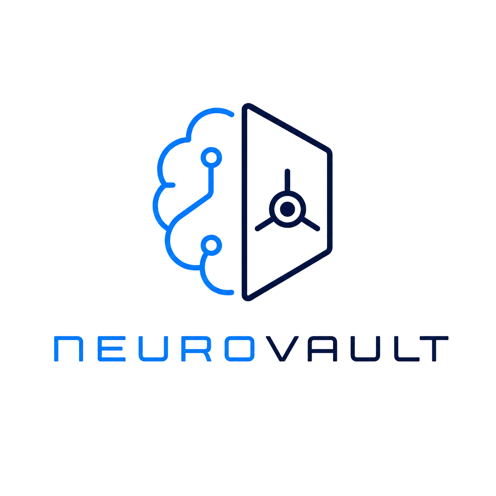
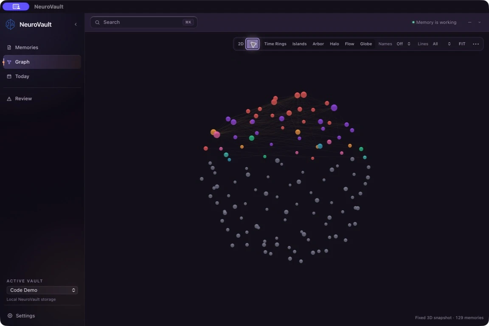
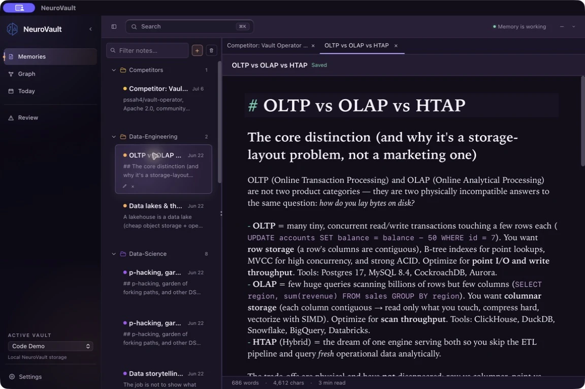
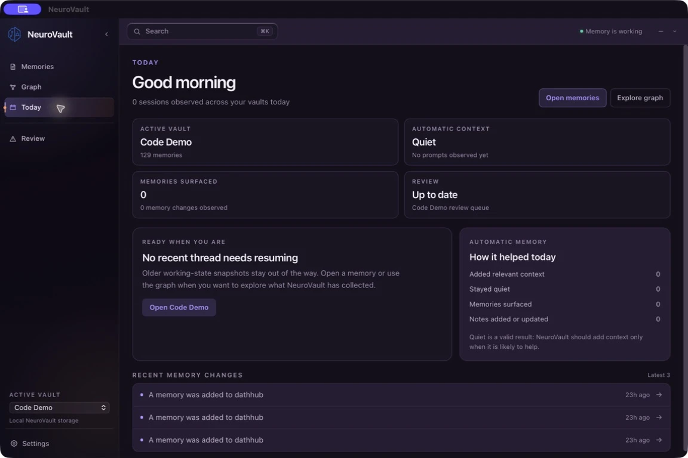
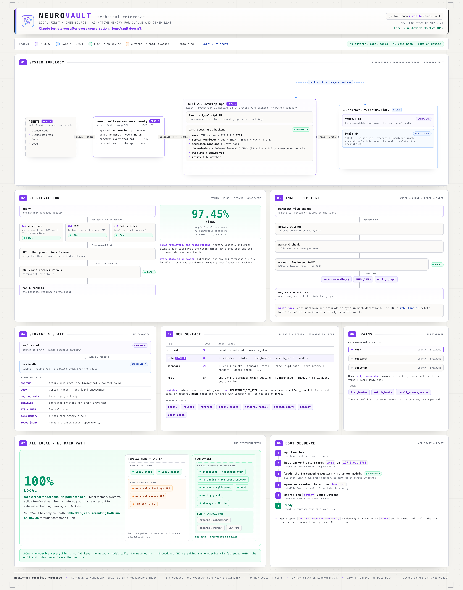

<div align="center">

<picture>
  <source media="(prefers-color-scheme: dark)" srcset="assets/brand/neurovault-logo-dark.png">
  
</picture>

### Local-first AI memory for Claude and any MCP agent

Claude forgets you after every conversation. **NeuroVault doesn't.**

[](https://github.com/sirdath/NeuroVault/actions/workflows/ci.yml)
[](LICENSE)
[](https://github.com/sirdath/NeuroVault/releases/latest)
[](https://github.com/sirdath/NeuroVault/releases)
[](https://github.com/sirdath/NeuroVault/stargazers)


**[Download](#download--install) · [Documentation](https://neurovault.dathproject.com/docs) · [Website](https://neurovault.dathproject.com) · [Connect your agent](#connect-your-agent-mcp)**

</div>

<br>

NeuroVault is a **local-first memory layer for AI agents**. It sits between your Markdown notes and supported AI clients and gives them durable recall across sessions. Your notes stay as plain `.md` files and the local database is rebuildable; selected context reaches only the AI providers you deliberately connect, under the data flow described in [PRIVACY.md](PRIVACY.md).

The open local core follows the [Core Covenant](CORE-COVENANT.md): no required account, no remote kill switch, durable Markdown ownership, and no sale or model training on vault data.

> **No generative model ever reads your vault.** Writing a memory is chunking, ONNX embeddings, and regex entity extraction; reading one is vector math, BM25, and graph traversal. Every hit comes back with the channels that surfaced it, its kind, its date, the agent that wrote it, and the path to its Markdown file. [What this is that a document search isn't ↓](#what-this-is-that-a-document-search-isnt)

## The app

<div align="center">
  <a href="docs/screenshots/graph.webp">
    
  </a>
  <p><strong>Graph.</strong> Explore the same memories as a connected local knowledge map. This capture uses the fixed 3D snapshot view.</p>
</div>

<table>
  <tr>
    <td width="50%" align="center"><a href="docs/screenshots/memories.webp"></a></td>
    <td width="50%" align="center"><a href="docs/screenshots/today.webp"></a></td>
  </tr>
  <tr>
    <td valign="top"><strong>Memories.</strong> Read and edit the Markdown source of memory, with vault and note navigation kept visible.</td>
    <td valign="top"><strong>Today.</strong> See the active vault, automatic-context activity, review state, and recent memory changes at a glance.</td>
  </tr>
</table>

---

## Download & install

Latest release: **[github.com/sirdath/NeuroVault/releases/latest](https://github.com/sirdath/NeuroVault/releases/latest)**

> **macOS is the first-class target — and only on Apple Silicon.** Requirements: an **M-series Mac** running **macOS 14 (Sonoma) or newer**. **Intel Macs are not supported**, and not just as a download: the only `sqlite-vec` (`vec0`) build in this repo is arm64 and it is loaded on every brain open, so an x86_64 build from source gets a library it cannot load. On macOS 11–13 the app launches and then cannot open any database.

**macOS (Apple Silicon)** — download `NeuroVault_*_aarch64.dmg`, open it, drag the app to Applications. It is signed with a Developer ID certificate and notarized by Apple, so Gatekeeper accepts it as software from an identified developer.

Windows and Linux builds exist and are produced by the same release workflow, but they are not signed, notarized, or dogfooded the way the macOS build is:

| Platform | Asset | Signed? |
|---|---|---|
| **macOS Apple Silicon (M1–M4), macOS 14+** | `NeuroVault_*_aarch64.dmg` | ✅ Developer ID + notarized |
| **Windows x64** | `NeuroVault_*_x64-setup.exe` (NSIS installer) | ⚠️ Not code-signed — see below |
| **Linux x64** | `NeuroVault_*_amd64.AppImage` / `*.deb` / `*.rpm` | n/a (updater signatures provided) |
| **macOS Intel** | Not supported — see above | — |

Notes are saved as plain Markdown in `~/.neurovault/`.

### Verify the download before first launch

Every installer carries a **Sigstore build provenance attestation** — a signed, transparency-logged statement that these exact bytes were produced by this repo's release workflow. With the [GitHub CLI](https://cli.github.com/):

```bash
gh attestation verify NeuroVault_0.6.2_aarch64.dmg --repo sirdath/NeuroVault
```

That is a stronger check than a hash published beside the file: a checksum only proves the download matches whatever the release page says, while the attestation ties the artifact to the workflow run that built it. (Releases do **not** ship a separate `SHA256SUMS` file; GitHub does display a per-asset SHA-256 digest on the release page if you want a second look.) Each release also ships an SPDX SBOM (`neurovault-*.spdx.json`).

If macOS says an official `.dmg` is damaged or cannot be verified, **do not disable quarantine or bypass the warning** — delete the file and report the release URL through the project [security process](SECURITY.md).

**Windows artifacts are not code-signed yet.** SmartScreen will say *"Windows protected your PC"* and show the publisher as unknown. That is expected for now, not a sign of tampering — an Authenticode certificate is on the roadmap. Run `gh attestation verify` against the `.exe` first, then choose **More info → Run anyway**. If you would rather not, use the macOS build, a Linux build, or [build from source](#quick-start-developers).

#### 🐧 Linux

The AppImage runs without warnings — run `chmod +x NeuroVault_*.AppImage` first if your file manager doesn't mark it executable.

> **Updates** — NeuroVault installs signed updates in place from the top-bar **Update** button. Checks are manual by default; you can explicitly enable a launch check in **Settings → General**. Update requests never include vault content or a stable install identifier, and updates never touch data under `~/.neurovault/`.

## What you get

- **Graphify your codebase** — point NeuroVault at a repo and it becomes part of your active vault: files, symbols, and call edges parsed **on-device** (tree-sitter — Rust, Python, TS/TSX, Go, Java, C#, Ruby) and rendered as a gold layer in the graph. Your connected AI can ask `where_defined`, `who_calls`, `blast_radius` (what breaks if I change this?) — and `fuse` links code to the notes and decisions about it. NeuroVault does not upload source while building the graph.
- **Knowledge graph view** — your notes as a living, force-directed map. In Analytics mode the on-canvas legend decodes the encoding: **fill / tint = category** (folder), **size = how often referenced**, **faded = dormant**, and a **rim = hub or newly added**. Spread/zoom controls, animations toggle, Venn-style category grouping, time-lapse playback, and a click-to-frame cluster legend.
- **Hybrid retrieval, always on** — semantic + BM25 keywords + knowledge graph, fused via RRF, with an optional cross-encoder reranker. In-process Rust.
- **Every result shows its work** — each hit carries a `why` string naming the channels that surfaced it (`semantic match 0.60 (rank 5) + keyword match (rank 1) + entity-graph link (rank 7); reranked 0.91`), plus its kind, creation date, authoring agent, and the vault-relative path to its Markdown file. [More ↓](#explainable-recall-every-hit-shows-its-work)
- **Markdown editor** with live preview, auto-save, drag-to-reorder tabs, and `[[wikilinks]]`.
- **Import inbox** — drag a file onto the window to copy it into a private staging area without changing the original. Connected workflows can turn staged material into indexed notes. [How it works →](https://neurovault.dathproject.com/docs#drop-folder)
- **Silent fact capture** — casually-dropped facts ("I prefer Rust over Go") get promoted to first-class memories with provenance back to where you said them. (Optional Claude Code hook, run by the same native `neurovault-server` binary — no Python.)
- **Multiple vaults** — separate files and databases per project; switch from the vault picker or command palette.
- **Per-folder boundaries** — drop a `.neurovault` file in a project directory to scope that folder's connected memory to its own vault (opt-in).
- **Agent auto-start** — your MCP agent starts the memory backend for you on first use; no need to open the app first.
- **Floating minitab + window modes** — shrink the whole app to a tiny always-on-top widget (status · start/pause · open), or **Minimize / Hide / Shrink to widget** from the top bar; bring it back with `Ctrl/Cmd+Shift+Space`.
- **Open a folder as a vault** — point NeuroVault at an existing Obsidian vault; the folder stays in place.
- **Notes-tree + graph share colours**, themes, resizable panels, and **signed one-click auto-update**.
- **Local-first, with an exact network contract.** No NeuroVault account or telemetry. The server is loopback-only on `127.0.0.1:8765`; selected context leaves the Mac only through AI providers you deliberately connect, and model/update downloads are disclosed in [PRIVACY.md](PRIVACY.md).

## Connect your agent (MCP)

**One click (recommended):** in the installed app open **Settings → Connections**, expand **Claude Code**, and hit **Configure automatically** — it merges NeuroVault's entry into `~/.claude.json` and leaves your existing login and other MCP servers untouched. Restart your Claude Code session. The same panel has a copy-ready snippet (and the exact config-file path) for Claude Desktop, Cursor, VS Code, Continue, and any other stdio MCP client. Full walkthrough in the [Quickstart](https://neurovault.dathproject.com/docs#quickstart).

**Or from a terminal** (Claude Code only):

```bash
claude mcp add --scope user neurovault \
  /Applications/NeuroVault.app/Contents/MacOS/neurovault-server -- --mcp-only
```

**Manual JSON (the fallback).** Point your MCP client at the bundled native MCP server — `neurovault-server --mcp-only`, a Rust stdio↔HTTP bridge built on the official [rmcp](https://github.com/modelcontextprotocol/rust-sdk) SDK (no Python):

```json
{
  "mcpServers": {
    "neurovault": {
      "command": "/Applications/NeuroVault.app/Contents/MacOS/neurovault-server",
      "args": ["--mcp-only"]
    }
  }
}
```

That block goes in one of these files (macOS paths; create the file if it doesn't exist, and **merge** the `neurovault` key into any existing `mcpServers` object rather than replacing the file):

| Client | File |
|---|---|
| **Claude Code** | `~/.claude.json` — user scope. Not `~/.claude/.mcp.json`, which Claude Code only reads for project approval. The app's generated snippet also sets `"type": "stdio"`. |
| **Claude Desktop** | `~/Library/Application Support/Claude/claude_desktop_config.json` |
| **Cursor** | `~/.cursor/mcp.json` (all projects) or `.cursor/mcp.json` (one project) |
| **VS Code** | `.vscode/mcp.json` — same shape but the top-level key is `servers`, and each entry adds `"type": "stdio"` |
| **Anything else** | transport `stdio`, command = the path above, args `["--mcp-only"]` |

On Windows and Linux the same `neurovault-server` binary ships next to the app; **Settings → Connections** prints the resolved absolute path for your install, so copy it from there rather than guessing.

> **Tiers** — by default the agent loads the **`lite`** tier (9 tools). Switch to `standard` (21) or `full` (55, includes the graphify code tools) by writing `~/.neurovault/mcp_tier.txt`, setting `NEUROVAULT_MCP_TIER`, or turning on **Settings → General → Developer options** and using the picker in **Settings → Developer**. Fewer tools = less context the agent pays for up front.

The MCP server forwards to the Rust HTTP server in the running app on `127.0.0.1:8765`. You don't need to open the app first — it **auto-starts the backend** if it isn't already running (disable with `NEUROVAULT_AUTOSTART=0`). Now say *"remember that I prefer Tauri over Electron"*; weeks later, ask *"what desktop framework do I like?"* and it recalls instantly.

## Automatic memory (zero effort)

MCP memory has a known weakness: the agent only remembers if it *decides* to call `recall` — and models routinely don't. NeuroVault fixes this with **automatic recall** for Claude Code: relevant memories are injected into every prompt automatically, no tool call needed.

Turn it on from the top-level **Privacy & Trust** view — the **Automatic context** card, button **"Turn on automatic context"** (the same card pauses it again). It is deliberately *not* buried in Settings: one switch, one place, with a receipt for every decision. Or from the terminal:

```bash
NV=/Applications/NeuroVault.app/Contents/MacOS/neurovault-server
"$NV" hook install       # wires ~/.claude/settings.json
"$NV" hook status
"$NV" hook uninstall
```

(The `neurovault-server` binary is not on `$PATH` after a DMG install — use the full path, or the one **Settings → Connections** prints for your install.)

How it works: Claude Code [hooks](https://code.claude.com/docs/en/hooks) run NeuroVault on every prompt (`UserPromptSubmit`) and at session open (`SessionStart`). Each prompt goes through **Ambient Recall**: the full hybrid retriever (semantic + BM25 + graph, fused, then a cross-encoder reranker) followed by a precision gate that decides whether anything is trustworthy enough to inject. Injected memories arrive as compact, sanitized background context with IDs, source paths, and a one-line "why". At session start you get a one-shot vault brief: core memory, top memories, open tasks.

**Ambient Recall prefers silence over weak context.** Vector search always has *some* nearest neighbor, so an ungated injector would decorate every prompt with plausible-but-useless notes. The gate requires an absolute cross-encoder score floor (raised further for vague prompts, relaxed slightly for exact file/symbol/error matches) and a margin over the runner-up — when confidence is low it injects **nothing**, and that's a success, not a failure. Every decision (inject or silent, with all scores) is logged to `~/.neurovault/logs/ambient_recall.jsonl`.

Design guarantees:

- **Fail-open.** If NeuroVault isn't running, the hooks print nothing and exit 0 — your Claude Code session is never blocked or slowed (hard 3.5 s budget). The installed hook command is wrapped so even a broken or stale binary can't block a prompt.
- **Signal only.** Trivial prompts are skipped before any network call, gated memories need real relevance scores, and a memory is never injected twice in the same session.
- **Reversible.** Install is idempotent and edits only NeuroVault's own entries in `settings.json` (a backup is written first); uninstall removes exactly those.
- **Tunable.** Thresholds, budgets, strict mode, and per-vault overrides live in `~/.neurovault/ambient.json`; debug any prompt with `"$NV" ambient test "your prompt"` — it prints the candidate table, every score, and the gate's reasoning. Details: [docs/ambient-recall.md](docs/ambient-recall.md).

> Automatic context always runs the cross-encoder — the gate's confidence floor is a cross-encoder probability, so it has no meaning without one. Turning this on downloads the ~1 GB reranker model once if you don't already have it.

## How it works

```
You write a note in the editor
  -> Auto-saved as markdown in your vault
  -> File watcher triggers the ingest pipeline
  -> Text chunked, embedded locally, entities extracted, knowledge graph updated

You drop a fact in conversation ("I prefer Tauri 2.0 over Electron")
  -> A UserPromptSubmit hook runs it through a regex extractor
  -> 8 patterns catch preferences, decisions, deadlines, identities, stacks
  -> Each fact becomes a first-class kind='insight' engram
  -> With a wiki-link back to the original observation for provenance

You ask the agent a question
  -> Agent calls recall() via MCP
  -> Hybrid search: semantic + BM25 + knowledge graph, fused via RRF
  -> Age decay tilts the ranking toward newer notes; superseded and
     deleted notes are filtered out of the pool entirely
  -> Each hit returns with its `why`, kind, date, author, and file path

After meaningful exchanges
  -> Write-back extracts durable facts and saves them as new notes
  -> Automatic context re-scores them by type-aware salience: working
     state goes stale in days, decisions stay warm for months
```

## What this is that a document search isn't

The retrieval itself is standard good practice: hybrid dense + sparse + graph, fused with RRF, optionally reranked by a cross-encoder. We are not claiming a new algorithm — we measured this one on the full 470-question LongMemEval set and [published every per-question receipt](docs/benchmarks/). What makes NeuroVault a memory rather than an index is what surrounds the retriever. Four claims, all checkable in this repo:

| Claim | What makes it true | Where to check |
|---|---|---|
| **No generative model reads your data** — not at write, not at read | Ingest is chunking + ONNX embeddings + regex entity extraction. Retrieval is vector math, BM25, and graph traversal. There is no LLM in either path, so there is nothing to leak to and nothing that can hallucinate a fact into your vault. This is architecture, not policy. | `src-tauri/src/memory/{ingest,entities,retriever}.rs` |
| **The agent writes back, and can be corrected** | `remember` adds, `update` corrects, `supersede_note` retires a stale fact (superseded engrams are filtered out of the default candidate pool — `superseded_by IS NULL`), and `find_contradictions` / `resolve_contradiction` surface and settle conflicts reversibly. A document index is read-only; a memory isn't. | `write_ops.rs`, `retriever.rs` |
| **Every result shows its work** | A one-line `why` naming the channels that fired and their ranks, plus `kind`, `created_at`, `agent_id`, and the vault-relative `.md` path. No fusion arithmetic, no raw logits — things a reader can act on. | `retriever.rs::explain_hit` |
| **The index is disposable** | Markdown in `vault/` is canonical. Delete `brain.db` and it rebuilds from the files. Nothing you wrote lives only inside a database. | `~/.neurovault/brains/<id>/` |

### Explainable recall: every hit shows its work

Most memory tools hand an agent a similarity score and expect it to be trusted. A bare `0.71` is not evidence — it says nothing about *why* a note surfaced, and an agent cannot tell a strong exact-term match from a vague nearest neighbour. So every hit NeuroVault returns explains itself. The shape of one hit:

```jsonc
{
  "engram_id": "…", "title": "…", "content": "…",
  "score": 0.41,          // retrieval relevance
  "confidence": 0.9,      // how much to TRUST the fact — a separate axis
  "kind": "decision",     // provenance class
  "created_at": "…",      // when the note was written
  "source": "decisions/tauri-over-electron.md",   // canonical Markdown
  "agent_id": "claude-code",                      // who wrote it
  "why": "semantic match 0.60 (rank 5) + keyword match (rank 1) + entity-graph link (rank 7); reranked 0.91"
}
```

*(Illustrative payload; the `why` string is verbatim from `explain_hit`'s tests in `retriever.rs`.)*

Read the `why` and you know what to do with the hit: a keyword-only match on a rare term is strong evidence; a weak semantic-only match is a guess; `linked neighbour (spreading activation)` means the graph brought it in, not the query. `source` is the path to the canonical Markdown — cite or open that, never the index. `confidence` is a separate axis from `score`: how much to trust the *fact*, derived structurally from `kind` (source-mirrored 1.0, authored notes ≈0.9, passive observations ≈0.6) and never used for ranking.

Only the reranker's probability is printed, never its logit, and the RRF arithmetic never leaks — a reader learns nothing actionable from `rrf 0.031 > 0.028`.

## Features

**Multiple vaults** — separate memory spaces, each with its own Markdown boundary, database, and graph. Switch instantly via the dropdown or a connected agent.

**Hybrid retrieval** — three signals merged via Reciprocal Rank Fusion: semantic vector similarity (50%), BM25 keywords (30%), knowledge-graph traversal (20%).

**Cross-encoder reranker (opt-in)** — a second-stage scorer that reads `(query, document)` as one input instead of comparing two independent embeddings. Worth **+3.8pp hit@5** on LongMemEval, at ~50–100 ms per call and a **~1 GB** model that stays resident. It is **off on a fresh install** — nobody who has never been asked gets signed up for a gigabyte — and a `rerank` argument on `recall()` decides per call. Turn it on for good under **Settings → Developer → Recall Reranking** (enable **Settings → General → Developer options** first). Automatic context enables it unconditionally, because its gate is a cross-encoder probability.

**Type-aware decay** — memories age at a rate that matches what they are, not one global curve. Automatic context scores each candidate with an exponential recency term whose **half-life depends on the engram's kind**: working state 2 days, tasks 14 days, decisions 180 days, preferences / playbook rules / sources 365 days, everything else 90 days. That recency term is 25% of a salience score also fed by use count, importance, structural confidence, source reliability, and graph links to live decisions or deadlines — and the per-component breakdown is serialized and logged, never folded into an opaque number. On the `recall()` path the same idea appears as a query-time tilt: candidates get a rank-relative recency spread plus exponential age decay, tightened when the query reads as asking for something current and switched off entirely when it reads as historical.

**Superseding, not deleting** — `supersede_note` retires a stale fact by writing a `superseded_by` pointer to the newer one. Superseded engrams drop out of the default candidate pool, but the Markdown is untouched, the supersession is a journal event, and `temporal_recall(include_superseded=true)` still returns the old fact. A correction is reversible; a delete wouldn't be.

**Graph view** — force-directed visualization. In Analytics mode: fill/tint encodes category, size encodes how often a note is referenced, fading marks dormancy, and a rim marks a hub or a newly added note. Click a node to open, drag to pin, click a cluster in the legend to frame it.

**Drop-folder ingest** — a per-vault **`raw/`** folder (with a `README.md` guide inside); paste documents there and the connected agent converts them into clean notes (no bundled converters — the agent is the converter). Originals are kept in `raw/_done/`.

**Silent fact capture** — a UserPromptSubmit hook pipes prompts through a regex extractor recognising 8 patterns (preferences, decisions, stacks, deadlines, identity, anti-preferences, deploy targets, explicit "remember that…"). Microseconds, no LLM call, bounded to 3 extractions/message, `<private>` blocks stripped.

**Session wake-up** — `session_start` returns layered context: L0 (~100 tokens, identity), L1 (~300 tokens, top active memories), L2 (on demand via `recall()`).

**Vault diagnostic** — a one-click health scorecard for your vault. Distils the graph into five graded categories + a headline grade and a worst-first list of fixes. "Copy report" emits a plain-text scorecard you can paste to your agent, so it acts on the issues — the maintenance loop the agent is meant to own.

```
NeuroVault vault diagnostic — work
Overall: B  (84/100, 412 notes)

Connectivity  ██████████████████████░░  88%
Interlinking  ███████████████░░░░░░░░░  63%
Cohesion      ███████████████████████░  94%
Freshness     ██████████████████░░░░░░  74%
Organization  ████████████░░░░░░░░░░░░  51%

Top fixes:
  - 49 orphan notes with no links — connect or merge them
  - 201 unfiled notes in the root — sort into folders
```

---

## Quick start (developers)

**Prerequisites:** [Node.js](https://nodejs.org/) **22** (what [CI pins](.github/workflows/ci.yml) — use that if you want your local results to match), [Rust](https://rustup.rs/). That's it — the MCP server is a native Rust binary (`neurovault-server`), built alongside the app. No Python is needed to build or run anything. (The only Python in the repo is offline tooling the app never invokes: the `eval/` retrieval harness, the `docs/benchmarks/` report mergers, and two icon generators in `scripts/`.)

```bash
git clone https://github.com/sirdath/NeuroVault.git
cd NeuroVault
npm install

# One terminal — the Tauri shell hosts the React frontend AND the
# in-process Rust HTTP server on 127.0.0.1:8765. Nothing else to start.
npx tauri dev

# Release build (installer at src-tauri/target/release/bundle/):
npx tauri build
```

**First run downloads** (once, then cached — instant after that). Both land in `~/.neurovault/.fastembed_cache/`:

- **~130 MB** — the embedding model **BGE-small-en-v1.5**, on first ingest or recall. Unavoidable; this is the retriever.
- **~1 GB** — the **cross-encoder reranker** (BGE-reranker-base), **only if you enable it**. It is off on a fresh install, so a new user's first search costs 130 MB, not 1.1 GB. Turning on automatic context also pulls it, since the ambient gate is a cross-encoder probability.

The `sqlite-vec` (`vec0`) native extension ships **bundled** with the app — no separate install. The macOS build we ship is **arm64 and macOS 14+ only**: that is the deployment target of the bundled extension, and it is loaded on every brain open. Building on an Intel Mac does **not** produce a working app — the repo carries only the arm64 `vec0.dylib`, so an x86_64 build gets a library it cannot load. Intel support needs an x86_64 (or universal) `vec0` build first.

## MCP tools

Exposed to any MCP-speaking agent via the native Rust MCP server — **55 tools**, gated by a **tier** system so agents only pay for the slice they use: `minimal` (3) · `lite` (9, the default) · `standard` (21) · `full` (55, includes the graphify code tools). Set it with `NEUROVAULT_MCP_TIER`, `~/.neurovault/mcp_tier.txt`, or the picker in **Settings → Developer** (enable **Settings → General → Developer options** first). Every tool takes an optional `brain` parameter to target a specific brain. Highlights:

| Tool | What it does |
|------|-------------|
| `recall(q, mode, limit, rerank?)` | Hybrid search — semantic + BM25 + graph via RRF; every hit carries `why` + `kind` + `created_at` + `source` + `agent_id`. `rerank` opts the cross-encoder in per call. PageRank prior in Analytics mode. |
| `recall_chunks(q, limit)` | Same retrieval, returns matching paragraphs instead of whole notes. Cheaper. |
| `related(engram_id, hops, link_types?)` | Direct graph neighbours of an engram. ~50× cheaper than a fresh recall. |
| `remember(content, title?, dedupe?)` | Save a memory (chunk + embed + entities + graph link). |
| `list_inbox` / `read_inbox_file` / `mark_inbox_done` | Drop-folder workflow — read raw dropped files and turn them into notes. |
| `session_start(agent?, since?)` | Wake-up: brain stats + L0 identity + top memories + open todos in one call. Pass `agent=X` to scope it to X's own recent engrams + X's inbox instead of the brain-wide view. |
| `handoff(to_agent, type, …)` / `agent_inbox(agent)` | Multi-agent coordination — route a directed, inert message to another agent through the shared brain, and read the open handoffs addressed to an agent. Pull-based; nothing auto-runs. |
| `core_memory_set` / `_append` / `_replace` / `_read` | Persona-style always-included blocks (Letta pattern). |
| `list_brains` / `switch_brain` / `create_brain` | Multi-brain navigation. |
| `check_duplicate(content, threshold)` | Pure cosine pre-check before `remember()`. |
| `list_unnamed_clusters` / `set_cluster_names` | Agent-driven cluster naming for the graph's Analytics mode. |
| `find_contradictions` / `supersede_note` / `resolve_contradiction` | Surface conflicting memories and reconcile them — the newer fact wins, reversibly. |
| `temporal_recall` / `engram_history` / `diagnose_brain` / `find_clutter` | Time-travel queries, per-note edit history, and brain-health/maintenance tools. |
| `rebuild_wikilinks` | Re-resolve every `[[wikilink]]` across the brain — fixes forward references and links to titles with a `(parenthetical)` suffix. |

---

## Architecture

**[Full technical reference map](docs/reference.html)** — the whole system on one page: topology, the hybrid retrieval core, ingest, storage, the 55-tool MCP surface, and why every path is on-device (no external model calls, no paid path).

[](docs/reference.html)

```
+-------------------------------------------------+
|  Tauri 2 desktop app (React 19 + TypeScript)    |
|  Editor / Graph / Sidebar / Command palette     |
+-----------------------+-------------------------+
                        | Tauri commands  +  HTTP :8765
+-----------------------v-------------------------+
|  In-process Rust backend                        |
|  - axum HTTP server (the MCP server talks here) |
|  - hybrid retriever (semantic + BM25 + graph)   |
|  - fastembed-rs (BGE-small ONNX, local)         |
|  - notify file watcher                          |
+-----------------------+-------------------------+
                        | SQL + vec0
+-----------------------v-------------------------+
|  SQLite + sqlite-vec  (~/.neurovault/...)       |
|  brain.db, vault/*.md, raw/, assets/, cache/    |
+-------------------------------------------------+

External:
  + neurovault-server --mcp-only — native Rust stdio<->HTTP MCP server
    (rmcp; bundled binary). Your agent spawns it per session; no Python.
    The same binary also serves the Claude Code lifecycle hooks
    (`neurovault-server hook …`). No Python anywhere in the product.
```

Markdown in `vault/` and inputs in `raw/` are **canonical**; everything in `cache/` and `brain.db` is **rebuildable**. If the index breaks, rebuild from the files. You own your memories. Full layout + privacy details: [PRIVACY.md](PRIVACY.md).

## Tech stack

| Layer | Technology |
|-------|-----------|
| Desktop | Tauri 2 (no Electron — the v0.6.1 macOS DMG is 28 MB; ~83 MB installed) |
| Frontend | React 19, TypeScript (strict), Tailwind v4, Zustand |
| Editor | CodeMirror 6 |
| Graph | `react-force-graph-2d/3d` (lazy-loaded), d3-force, canvas painting |
| **Backend (in-process)** | **Rust + axum, fastembed-rs ONNX embeddings, rusqlite + sqlite-vec, notify, parking_lot, tokio** |
| Vector search | sqlite-vec (KNN in pure SQL) |
| Embeddings | BAAI/bge-small-en-v1.5 (384 dims, local, free) |
| Keywords | BM25 (Rust port of Okapi) |
| Graph metrics | Vanilla TS PageRank + Louvain |
| MCP server | `neurovault-server --mcp-only` — native Rust ([rmcp](https://github.com/modelcontextprotocol/rust-sdk)), forwards stdio↔HTTP to `:8765` (replaces the old Python proxy) |

## Performance

| Operation | Time |
|-----------|------|
| Embed a note | ~20 ms |
| Recall (no reranker) | ~73 ms median |
| Recall (with reranker) | ~133 ms median |
| Full vault ingest (25 notes) | ~4 s cold start |

**Retrieval quality** — measured on the full **470-question [LongMemEval](https://github.com/xiaowu0162/LongMemEval) benchmark** (long multi-session histories, facts that get updated and contradicted, temporal reasoning), using NeuroVault's real `recall()` path with the cross-encoder reranker enabled and **100% on-device** embeddings:

| hit@5 | hit@10 | recall@5 | MRR | hit@1 |
|-------|--------|----------|-----|-------|
| **97.45%** | **98.5%** | **0.938** | **0.902** | **0.847** |

> The right memory lands in the **top 5 results 97% of the time**, in the top 10 **99%** — running entirely on your machine, no cloud, no API keys. This is retrieval recall (was the right memory retrieved), not end-to-end QA accuracy.
>
> **Caveat, stated up front:** the harness **ablates the recency and title boosts** so the run is byte-reproducible — LongMemEval probes content, not freshness, and its documents have no real titles, so a synthetic "Chat on ⟨date⟩" title would let the serialization adapter manufacture signal in either direction. `--keep-recency` and `--keep-title-boosts` measure the production scorer instead. The reranker, which is opt-in in the app, was **on** for this run; the same harness scores **93.62% hit@5 engine-only**, so the cross-encoder is worth +3.8pp. Method, both configs, and a per-question receipt: [`docs/benchmarks/README.md`](docs/benchmarks/README.md); failure-mode forensics and the isolated reranker A/B: [`docs/benchmarks/ANALYSIS-2026-07-02-miss5-forensics.md`](docs/benchmarks/ANALYSIS-2026-07-02-miss5-forensics.md).

**Cost** — on-device embeddings and retrieval cost effectively nothing (your own machine, no per-call API). The retrieval engine and application are open source; the exact optional network flows are documented in [PRIVACY.md](PRIVACY.md).

## Keyboard shortcuts

| Shortcut | Action |
|----------|--------|
| `⌘N` | New note |
| `⌘S` | Save |
| `⌘K` | Command palette |
| `⌘⇧Space` | Quick capture |
| `⌘/` | Search memory |
| `⌘1` / `⌘2` / `⌘3` | Today / Memories / Graph |
| `⌘P` | Cycle Memories and Graph |
| `?` | All shortcuts |

On Windows and Linux, use `Ctrl` in place of `⌘`.

---

## Documentation

Full docs — quickstart, the graph view, drop-folder ingest, architecture, and the HTTP API — live at **[neurovault.dathproject.com/docs](https://neurovault.dathproject.com/docs)**.

In the repo:
- **[Troubleshooting & data](docs/TROUBLESHOOTING.md)** — install warnings, MCP setup, backup/move/export, recovering a corrupt index.
- **[How NeuroVault works](docs/HOW-NEUROVAULT-WORKS.md)** — the architecture and retrieval pipeline in depth.
- **[HTTP API](docs/api.md)** · **[Contributing](CONTRIBUTING.md)** · **[Privacy](PRIVACY.md)** · **[Security](SECURITY.md)**.

## Contributing

Issues and pull requests are welcome — start with [CONTRIBUTING.md](CONTRIBUTING.md) and [CODE_OF_CONDUCT.md](CODE_OF_CONDUCT.md). Opening a PR means agreeing to the [Contributor License Agreement](CLA.md): you keep your copyright, and the project gets a licence broad enough to relicense and distribute your work.

- **Questions, ideas, "is this a bug?"** → [Discussions](https://github.com/sirdath/NeuroVault/discussions).
- **Reproducible defects and feature requests** → [Issues](https://github.com/sirdath/NeuroVault/issues); [good first issues](https://github.com/sirdath/NeuroVault/issues?q=is%3Aissue+is%3Aopen+label%3A%22good+first+issue%22) are tagged.
- **Security** → do not open a public issue; follow [SECURITY.md](SECURITY.md).

## License

[MIT](LICENSE) © NeuroVault contributors.

<div align="center"><sub>Automatic enough to disappear. Transparent enough to trust.</sub></div>
